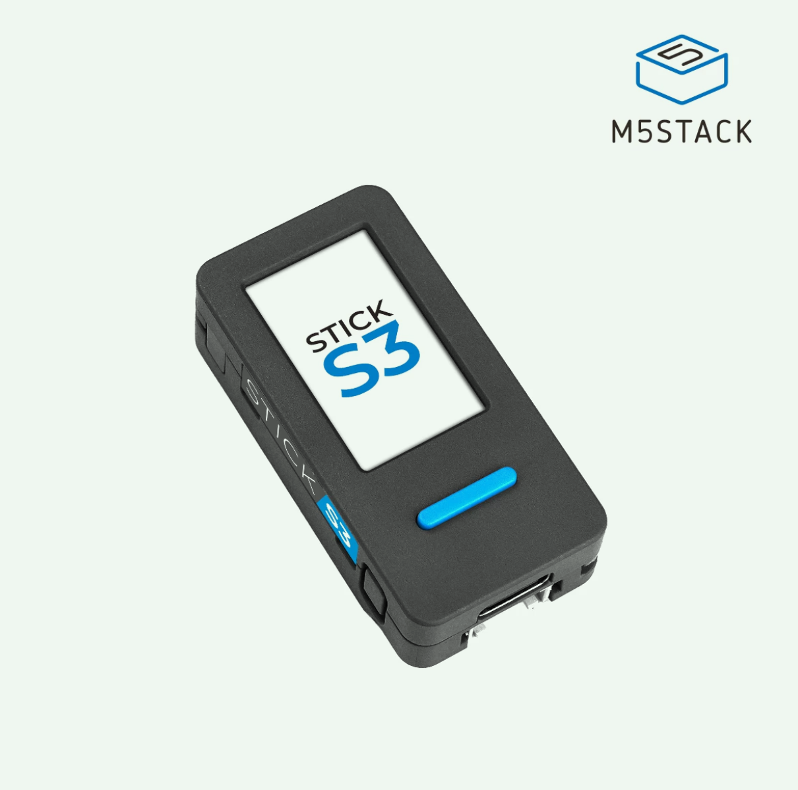

# claude-desktop-buddy

Claude for macOS and Windows can connect Claude Cowork and Claude Code to
maker devices over BLE, so developers and makers can build hardware that
displays permission prompts, recent messages, and other interactions. We've
been impressed by the creativity of the maker community around Claude -
providing a lightweight, opt-in API is our way of making it easier to build
fun little hardware devices that integrate with Claude.

> **This is a fork of
> [`anthropics/claude-desktop-buddy`](https://github.com/anthropics/claude-desktop-buddy).**
> It combines two things on top of upstream:
>
> 1. **M5StickS3 (ESP32-S3) support** — one codebase now runs on both the
>    original M5StickC Plus and the newer M5StickS3, via M5Unified. This is
>    the work of **[yiduo (易铎)](https://github.com/yiduo)**, from upstream
>    PR [#48](https://github.com/anthropics/claude-desktop-buddy/pull/48).
> 2. **An OpenPets pet importer** — `tools/import_openpet.py` turns any pet
>    from the [OpenPets](https://openpets.dev) gallery into a character pack
>    (with an optional `--flash`); `characters/pinchy/` is an imported example.
>
> Full details in [What this fork changes](#what-this-fork-changes).

> **Building your own device?** You don't need any of the code here. See
> **[REFERENCE.md](REFERENCE.md)** for the wire protocol: Nordic UART
> Service UUIDs, JSON schemas, and the folder push transport.

As an example, this is a desk pet that runs on M5Stack stick devices — the
ESP32 **M5StickC Plus** and the ESP32-S3 **M5StickS3**. It lives off
permission approvals and interaction with Claude: it sleeps when nothing's
happening, wakes when sessions start, gets visibly impatient when an approval
prompt is waiting, and lets you approve or deny right from the device.

<p align="center">
  
</p>

## Hardware

This fork runs on **two boards from one codebase**, built on
[M5Unified](https://github.com/m5stack/M5Unified), which auto-detects the
board at runtime:

| Board | MCU / peripherals | PlatformIO env |
| --- | --- | --- |
| **M5StickC Plus** (original) | ESP32 + AXP192 + MPU6886 | `m5stickc-plus` |
| **M5StickS3** | ESP32-S3 + M5PM1 + BMI270 + ST7789P3 + ES8311 | `m5stack-sticks3` |

The upstream firmware depended on the board-specific `M5StickCPlus` library,
which doesn't support the ESP32-S3. Migrating to M5Unified adds M5StickS3
support while keeping the original StickC Plus working — see
[What this fork changes](#what-this-fork-changes).

<p align="center">
  
</p>

## What this fork changes

The **M5StickS3 port** described in this section — everything under Board/build,
Bug fixes, and Behavior below — is the work of
[yiduo (易铎)](https://github.com/yiduo), from upstream PR
[#48](https://github.com/anthropics/claude-desktop-buddy/pull/48). It ports the
firmware to the **M5StickS3 (ESP32-S3)** while keeping the original M5StickC
Plus working. This fork's own addition is the
[OpenPets importer](#importing-pets-from-openpets) further down.

**Board / build**

- Migrated from the `M5StickCPlus` library to **M5Unified** (supports both
  boards, auto-detects at runtime).
- Added the `m5stack-sticks3` PlatformIO environment plus an 8MB partition
  table (`partitions_8mb.csv`) with a large LittleFS region for characters.
- New [`src/compat.h`](src/compat.h) shim maps the legacy APIs the code used
  onto M5Unified / M5GFX:
  - `TFT_eSprite` → `M5Canvas`; render targets → `lgfx::LGFXBase`
  - `M5.Axp.*` → `M5.Power.*`; `M5.Imu.getAccelData` → `getAccel`;
    `M5.Beep` → `M5.Speaker`
  - software RTC over the ESP32 system clock (the StickS3 has no RTC chip)
  - onboard-LED calls are no-ops on the StickS3 (it has no user LED — GPIO10
    there is the Grove port)

**Bug fixes surfaced on the S3**

- `dataPoll` no longer hangs the firmware: the serial drain is now driven by
  `read()`'s `-1` sentinel instead of `available()`, which on the S3's native
  USB-CDC could report bytes `read()` can't deliver and spin forever.
- `Serial.setTxTimeoutMs(0)` so USB-CDC writes don't block when no serial
  monitor is attached.
- `LittleFS.begin(true)` formats a fresh S3 partition on first boot.

**Behavior**

- BLE pairing switched to **Just Works** (encrypted + bonded, no PIN): the
  original random passkey-entry flow was unusable when pairing directly from
  Windows (a new code on every retry).
- Approval screen redesigned: the panel sizes to its content and shows the
  tool name + command in larger, readable text.

**Characters**

- New [`tools/import_openpet.py`](tools/import_openpet.py) imports any pet from
  the [OpenPets](https://openpets.dev) gallery as a character pack — resolve a
  name/slug/URL → download the spritesheet → slice the canonical 8×9 grid into
  the seven states → prep, with an optional `--flash`. See
  [Importing pets from OpenPets](#importing-pets-from-openpets).
- Added `characters/pinchy/` as an imported example pack (a nerdy lobster).

## Flashing

Install
[PlatformIO Core](https://docs.platformio.org/en/latest/core/installation/).
The repo defines two build environments (default: `m5stack-sticks3`); select
your board with `-e`:

```bash
# M5StickS3 (ESP32-S3)
pio run -e m5stack-sticks3 -t upload

# M5StickC Plus (original ESP32)
pio run -e m5stickc-plus -t upload
```

Add `--upload-port COM6` (Windows) or `--upload-port /dev/ttyACM0`
(Linux/macOS) if auto-detection picks the wrong port.

**M5StickS3 download mode:** if the S3 is still running other firmware (e.g.
the factory UIFlow) and the upload can't connect, put it in download mode
first — with USB connected, **hold the side (power) button until the inner
green LED blinks**, then run the upload. Once this firmware is running its
USB-serial port supports auto-reset, so later uploads don't need this.

To wipe a previously-flashed device first:

```bash
pio run -e m5stack-sticks3 -t erase && pio run -e m5stack-sticks3 -t upload
```

Once running, you can also wipe everything from the device itself: **hold A
→ settings → reset → factory reset → tap twice**.

## Pairing

To pair your device with Claude, first enable developer mode (**Help →
Troubleshooting → Enable Developer Mode**). Then, open the Hardware Buddy
window in **Developer → Open Hardware Buddy…**, click **Connect**, and pick
your device from the list. macOS will prompt for Bluetooth permission on
first connect; grant it.

<p align="center">
  
  
</p>

Once paired, the bridge auto-reconnects whenever both sides are awake.

If discovery isn't finding the stick:

- Make sure it's awake (any button press)
- Check the stick's settings menu → bluetooth is on

## Controls

|                         | Normal               | Pet         | Info        | Approval    |
| ----------------------- | -------------------- | ----------- | ----------- | ----------- |
| **A** (front)           | next screen          | next screen | next screen | **approve** |
| **B** (right)           | scroll transcript    | next page   | next page   | **deny**    |
| **Hold A**              | menu                 | menu        | menu        | menu        |
| **Power** (left, short) | toggle screen off    |             |             |             |
| **Power** (left, ~6s)   | hard power off       |             |             |             |
| **Shake**               | dizzy                |             |             | —           |
| **Face-down**           | nap (energy refills) |             |             |             |

The screen auto-powers-off after 30s of no interaction (kept on while an
approval prompt is up). Any button press wakes it.

## ASCII pets

Eighteen pets, each with seven animations (sleep, idle, busy, attention,
celebrate, dizzy, heart). Menu → "next pet" cycles them with a counter.
Choice persists to NVS.

## GIF pets

If you want a custom GIF character instead of an ASCII buddy, drag a
character pack folder onto the drop target in the Hardware Buddy window. The
app streams it over BLE and the stick switches to GIF mode live. **Settings
→ delete char** reverts to ASCII mode.

A character pack is a folder with `manifest.json` and 96px-wide GIFs:

```json
{
  "name": "bufo",
  "colors": {
    "body": "#6B8E23",
    "bg": "#000000",
    "text": "#FFFFFF",
    "textDim": "#808080",
    "ink": "#000000"
  },
  "states": {
    "sleep": "sleep.gif",
    "idle": ["idle_0.gif", "idle_1.gif", "idle_2.gif"],
    "busy": "busy.gif",
    "attention": "attention.gif",
    "celebrate": "celebrate.gif",
    "dizzy": "dizzy.gif",
    "heart": "heart.gif"
  }
}
```

State values can be a single filename or an array. Arrays rotate: each
loop-end advances to the next GIF, useful for an idle activity carousel so
the home screen doesn't loop one clip forever.

GIFs are 96px wide; height up to ~140px stays on a 135×240 portrait screen.
Crop tight to the character — transparent margins waste screen and shrink
the sprite. `tools/prep_character.py` handles the resize: feed it source
GIFs at any sizes and it produces a 96px-wide set where the character is the
same scale in every state.

The whole folder must fit under 1.8MB —
`gifsicle --lossy=80 -O3 --colors 64` typically cuts 40–60%.

See `characters/bufo/` for a working example.

If you're iterating on a character and would rather skip the BLE round-trip,
`tools/flash_character.py characters/bufo` stages it into `data/` and runs
`pio run -t uploadfs` directly over USB.

### Importing pets from OpenPets

`tools/import_openpet.py` turns any pet from the
[OpenPets](https://openpets.dev) gallery into a character pack in one shot —
resolve → download → slice → prep, with an optional `--flash`:

```bash
python3 tools/import_openpet.py pinchy                       # by gallery name
python3 tools/import_openpet.py https://openpets.dev/pets/pinchy-a4ca4e12
python3 tools/import_openpet.py wall-e --flash               # import + flash
```

Every OpenPets gallery pet ships the same 1536×1872 spritesheet (an 8×9 grid
of 192×208 frames) with a fixed row→animation layout, so the tool slices any
of them and maps the rows onto our seven states (e.g. the "failed" row →
`sleep`, "jumping" → `celebrate`). It auto-writes the manifest (sampling the
pet's body color) and a README with attribution back to the gallery. OpenPets
is MIT-licensed; individual pets' art copyright stays with their artists, so
keep that attribution if you redistribute a pack. `characters/pinchy/` is an
imported example.

## The seven states

| State       | Trigger                     | Feel                        |
| ----------- | --------------------------- | --------------------------- |
| `sleep`     | bridge not connected        | eyes closed, slow breathing |
| `idle`      | connected, nothing urgent   | blinking, looking around    |
| `busy`      | sessions actively running   | sweating, working           |
| `attention` | approval pending            | alert, **LED blinks**       |
| `celebrate` | level up (every 50K tokens) | confetti, bouncing          |
| `dizzy`     | you shook the stick         | spiral eyes, wobbling       |
| `heart`     | approved in under 5s        | floating hearts             |

> On the **M5StickS3** the attention **LED** doesn't apply — that board has no
> user LED. Everything else behaves the same.

## Project layout

```
src/
  main.cpp       — loop, state machine, UI screens
  buddy.cpp      — ASCII species dispatch + render helpers
  buddies/       — one file per species, seven anim functions each
  ble_bridge.cpp — Nordic UART service, line-buffered TX/RX
  character.cpp  — GIF decode + render
  data.h         — wire protocol, JSON parse
  xfer.h         — folder push receiver
  stats.h        — NVS-backed stats, settings, owner, species choice
  compat.h       — M5Unified shim (display/RTC/power/LED across both boards)
characters/      — example GIF character packs
partitions_8mb.csv — M5StickS3 (8MB) flash layout
tools/           — generators and converters
```

## Availability

The BLE API is only available when the desktop apps are in developer mode
(**Help → Troubleshooting → Enable Developer Mode**). It's intended for
makers and developers and isn't an officially supported product feature.
